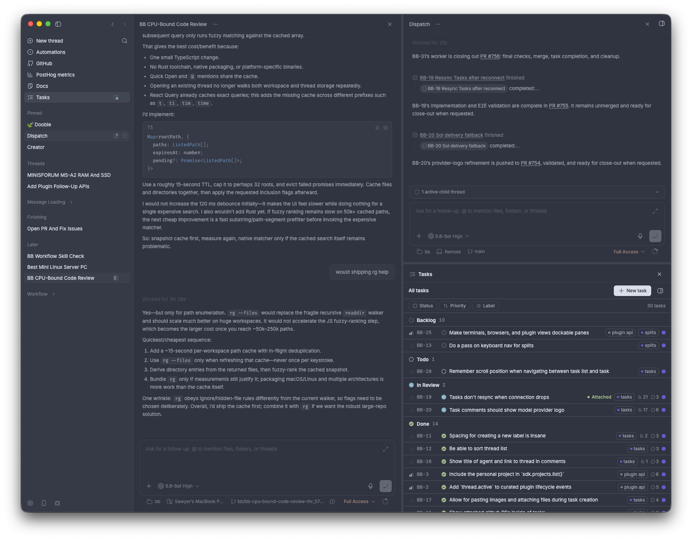

<p align="center">
  <picture>
    <source media="(prefers-color-scheme: dark)" srcset="https://github.com/user-attachments/assets/e40bda56-54a4-47f8-a417-6bbadf2e5b40">
    <source media="(prefers-color-scheme: light)" srcset="https://github.com/user-attachments/assets/4d9d02fb-c179-449b-a38a-041955143232">
    
  </picture>
</p>

# bb

[](https://www.npmjs.com/package/bb-app)

bb is an agentic IDE that can control itself. You can seamlessly
orchestrate all of your favorite coding agents together and have them
programmatically use bb too.

Every surface — the web app, CLI, and HTTP API — is a first-class way to
drive bb. Work runs in threads you can follow live, steer at any point,
or hand off to another agent.

> [!NOTE]
> bb is in active development. Core architecture is stable, but workflows
> and surfaces are still evolving.

<p align="center">
  
</p>

## Use bb

### Download the desktop app

The recommended way to start using bb is the desktop app:

**[Download the latest desktop app](https://github.com/ymichael/bb/releases/tag/desktop-latest)**

The desktop build is currently macOS Apple Silicon (arm64) only. Intel Mac,
Linux, and Windows users should run bb with `npx` instead.

### Or run it anywhere with npx

```bash
npx bb-app@latest
```

Then open `http://localhost:38886`.

bb uses the provider CLI you already have authenticated.

For install requirements, provider setup, configuration, and package-focused
docs, start with
[`packages/bb-app`](./packages/bb-app/README.md).

## Repository Overview

This monorepo contains the packaged app plus the runtime services it bundles:

| Package or app                                                     | Role                                                                                  |
| ------------------------------------------------------------------ | ------------------------------------------------------------------------------------- |
| [`packages/bb-app`](./packages/bb-app)                             | Published npm package and `npx bb-app@latest` launcher.                               |
| [`apps/app`](./apps/app)                                           | Web UI for inspecting projects, threads, environments, and running work.              |
| [`apps/server`](./apps/server)                                     | HTTP API, WebSocket notifications, state management, workspace provisioning, and the agent provider runtime. |
| [`apps/cli`](./apps/cli)                                           | Scriptable `bb` CLI for users and agents.                                             |
| [`packages/server-contract`](./packages/server-contract)           | HTTP and WebSocket contract between clients and the server.                           |
| [`packages/host-daemon-contract`](./packages/host-daemon-contract) | Schemas for the server's machine-local API used by the app and CLI (folder picker, open-in-editor, provider CLI status). |

## Development

Use the development loop when working on bb itself:

```bash
pnpm dev
```

That starts the Vite app and proxies API and WebSocket traffic to a separate
dev server. The launcher prints the actual ports at startup. Each checkout gets
a data directory under
`~/.bb-dev/<checkout-instance>/` and deterministic high ports derived from the
checkout path. The checkout instance id is the sanitized path to the checkout,
relative to your home directory, plus a short hash suffix. Separate worktrees
can run alongside each other and the packaged `npx bb-app@latest` instance.

Development behavior is intentionally split:

- the app hot reloads itself
- the server does not hot reload

When you want the server to pick up the latest build output, use:

```bash
pnpm dev:restart
```

This rebuilds first, then restarts the server. A dev restart interrupts any
in-flight agent turns; threads show the standard interrupted state and you
re-send.

To test the release-style package launcher from a source checkout:

```bash
pnpm start
```

That builds the local `bb-app` package artifacts and runs
`packages/bb-app/dist/bb-app.js`, matching the published `npx bb-app@latest` path
without downloading from npm.

```bash
pnpm bb --help            # built CLI, targets the default/prod instance
pnpm reset                # clear production state

pnpm bb:dev --help        # source CLI, targets this checkout's dev instance
pnpm reset:dev            # clear this checkout's dev state

pnpm reset:all            # clear both production and dev states
```

These reset commands prompt for confirmation before deleting anything.

## System Overview

### The runtime pieces

| Component      | Role                                                                                                                                                                                                                                                                                                                                                       |
| -------------- | ------------------------------------------------------------------------------------------------------------------------------------------------------------------------------------------------------------------------------------------------------------------------------------------------------------------------------------------------------------ |
| **Server**     | One process that runs everything: stores all state in a SQLite database, exposes an HTTP API, pushes change notifications over WebSocket, provisions workspaces, and runs the agent provider processes directly. The DB is the source of truth. It also serves a machine-local API for the app and CLI (open editor, pick folders, provider CLI status). |
| **App**        | Web UI for inspecting projects and threads, following progress, and steering work.                                                                                                                                                                                                                                                                          |
| **CLI** (`bb`) | First-class interface for both users and agents. Same capabilities as the app, scriptable.                                                                                                                                                                                                                                                                  |

### Data model

The core entities and how they relate:

**Project** — the top-level container, usually mapped to a repository. A project has one or more **sources** that say where its code lives: local paths on the machine running bb.

**Thread** — the unit of work. Each thread tracks a conversation with an agent provider, has lifecycle state, and produces an append-only stream of **events** (messages, tool calls, file changes, etc.). Threads can be **standard** (does work directly) or **manager** (coordinates other threads). Threads can own child threads for delegation.

**Environment** — the execution context for a thread: a workspace (a directory on disk) on the machine running bb. An environment can be **unmanaged** (point at an existing directory), or **managed**. Environments managed by bb will be cleaned up when there are no longer any unarchived threads using it. Multiple threads can share an environment.

### Contracts and boundaries

Two contract packages define the boundaries between clients and the server:

**`@bb/server-contract`** — the HTTP + WebSocket API between clients (app, CLI) and the server. Route schemas, request/response types, WebSocket notification types.

**`@bb/host-daemon-contract`** — the schemas for the server's machine-local API: the endpoints the app and CLI use for machine-local things like the folder picker, open-in-editor, and provider CLI status.

Clients only talk to the server through these contracts — they never reach into server internals.

## Further Reading

- [Vision](docs/VISION.md)
- [Platform support](docs/platform-support.md)
- [Configuration](docs/configuration.md)
- [Using bb on multiple devices](docs/multiple-devices.md)
- [Worktrees and setup scripts](docs/worktrees.md)

## Contributing

The most useful contributions are feature requests and bug reports. If you run into something broken, confusing, or missing, open an issue with the workflow you were trying to accomplish and what happened instead.
